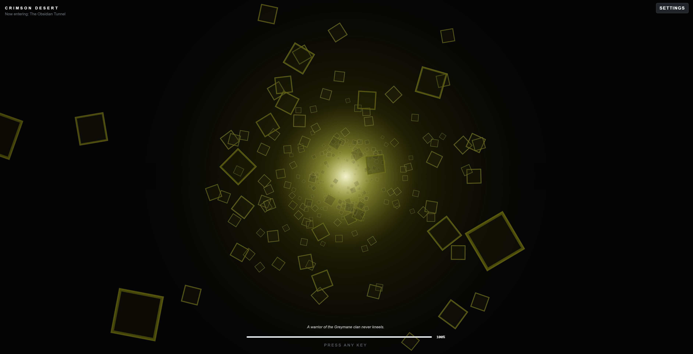

# Welcome to Crimson Desert — Loading Screen

This is a simple reacreation of the *Crimson Desert* loading screen: an infinite tunnel of geometric shapes moving past the camera towars a pulsing light at the very back of the canvas.

As usual, the project was built using **Bootstrap css classes only** and plain **JavaScript** with no TypeScript at all.

**Live controls (offcanvas sidebar)**

The app consists of layout containing both an aside and main elements. The sidebar contains the form with inputs that will help you control the canvas output; these are as follow:

- Geometric figure
- Shape velocity
- Shape count
- Canvas color
- Background sound
- and Volume

**Audio**

This form control will give you the opportunity to either choose an mp3 file from your device, paste a YouTube URL or simply play the canvas with no sound, your choice!.

---

Thanks for reading!